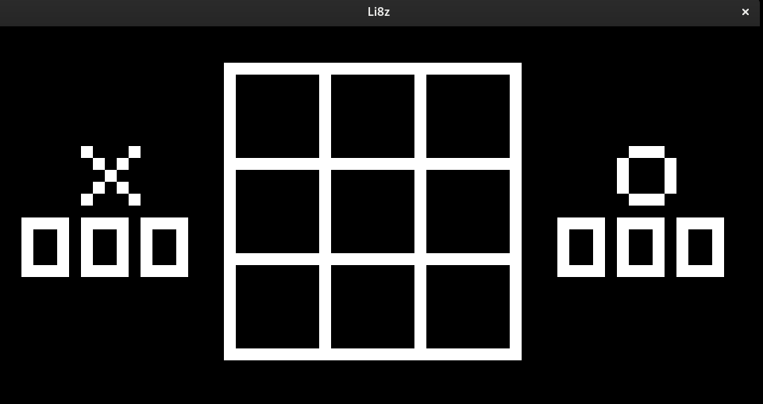

# Li8Z

Hey, this is **Li8Z**, an attempt at implementing a Chip-8 emulator in Zig. I
was inspired to try this project thanks to my
[buddy](https://github.com/kevontheweb). The project will be heavily guided by
this beautiful [guide](https://github.com/aquova/chip8-book).

The project is in a decent place right now, as you can load roms and play them.
Audio and controls work, with a few games experiencing some issues. For reference
this is tictactoe running on the emulator.



## Building

Though I tried to keep the project as zig only as possible, due to the immaturity
of the language I had to rely a bit on some C libraries, in particular
[raylib](https://www.raylib.com/) and [miniaudio](https://miniaud.io/) (through
a zig wrapper by
[zig-gamedev](https://github.com/zig-gamedev/zig-gamedev/tree/main/libs/zaudio)).

### Desktop Version

The `bootstrap.sh` and `boostrap.ps1` scripts are provided to pull the correct
packages and use them appropriately for the project. As builds are often tried
against the latest unstable version of zig (currently v0.14.0-dev.3445+), raylib is now built by the
bootstrapper using `cmake` and `ninja` as they guarantee reliability during a
tumultuous zig development cycle. After the script succeeds, you can build the
emulator with:

```bash
zig build --release=safe
```

The built binary can then be found in `zig-out/bin/li8z` and requires an
argument that is the path to the rom you would like to play. For testing you can
simply run:

```bash
zig build run -- /path/to/rom
```

### Web Version

The emulator can also be run in a web browser using WebAssembly. Requirements:
- Python 3.13+ (for the development server)
- Modern web browser with WebAssembly support

To build and run the web version:

```bash
# Build the WebAssembly module
zig build wasm

# Start the development server
./serve.sh

# Visit http://localhost:8080/web/ in your browser
```

## Controls

Both desktop and web versions use the same keyboard layout:
```
1 2 3 4  →  1 2 3 C
Q W E R  →  4 5 6 D
A S D F  →  7 8 9 E
Z X C V  →  A 0 B F
```

## Status

The bug present that affected some games when building in release mode has
been solved, so you may build in your preferred release mode with confidence.
The web port of the emulator is now functional with full support for:
- ROM loading
- Display output
- Keyboard input
- Sound (at 5% volume by default)
